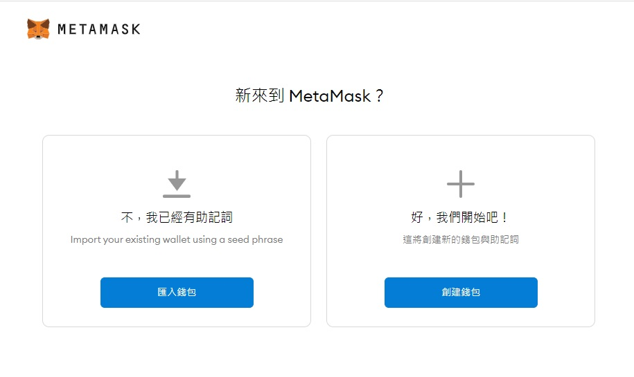
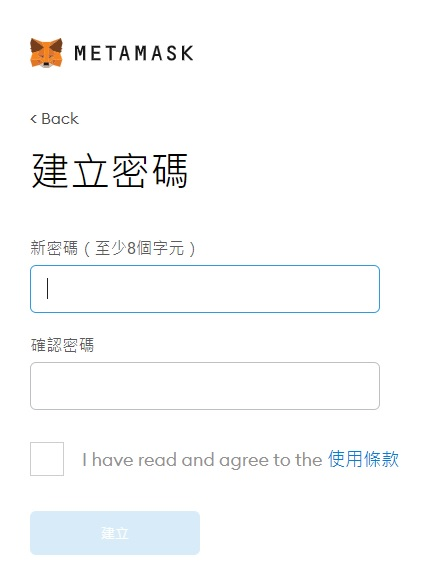
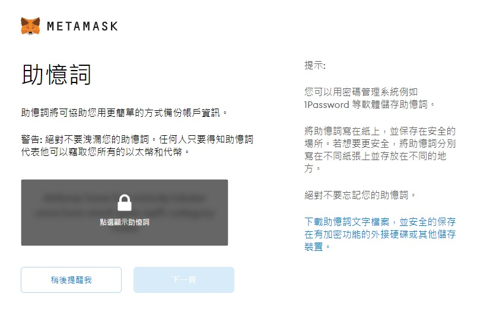
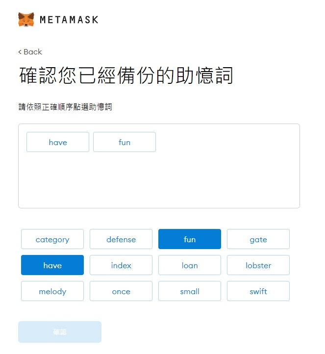
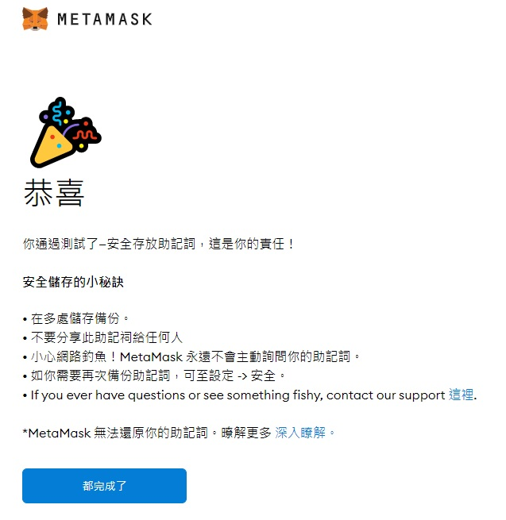
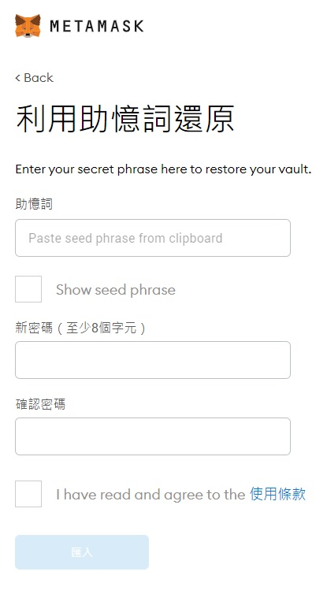
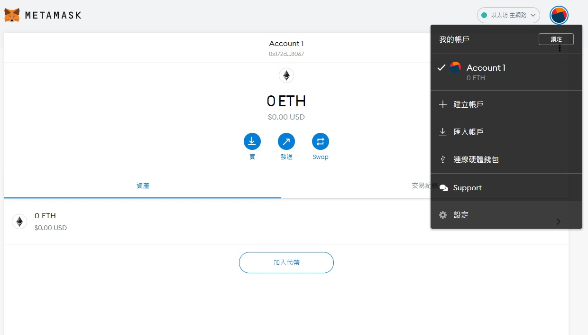
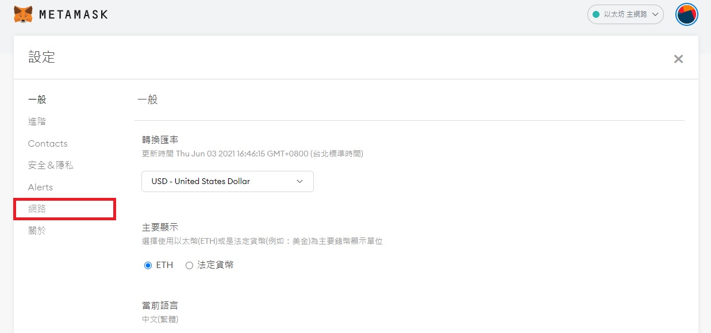
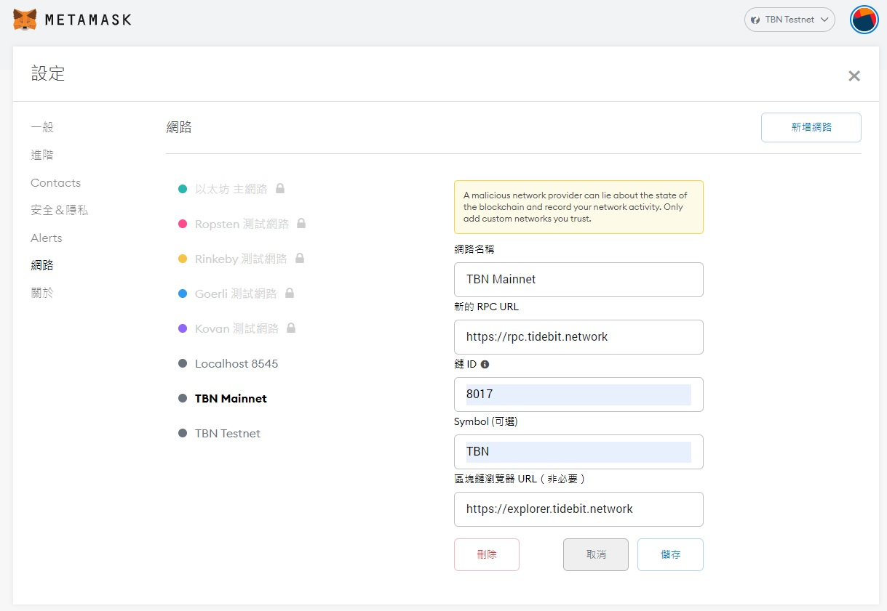
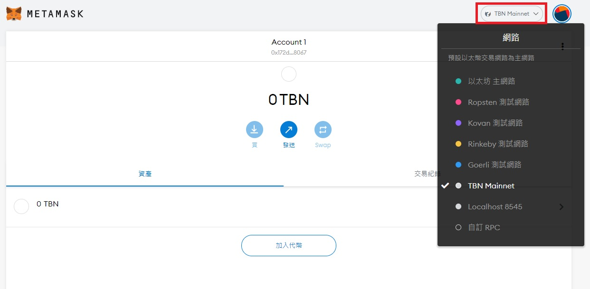

# Connect Metamask to Chain
本文將指引如何在 Tidebit chain 上使用 MetaMask

## 加密錢包
加密貨幣錢包用來儲存您的加密貨幣或代幣，不需經過中心化實體。有些人稱他們的錢包為他們的加密銀行，但他們可以保持代幣所有權。您可以使用 12 或 24 字的助記詞來控制加密錢包，允許用戶使用相同的助記詞在任何地方訪問他們的加密錢包。因此助記詞非常重要，如果丟失或被盜，您將會失去您的資產。

## MetaMask
功能齊全，操作簡便的加密錢包。

## 如何將 Metamask 錢包連接到 Tidebit chain

### Step 1
安裝並開啟 [MetaMask](https://metamask.io/download.html)

### Step 2
新建或匯入助記詞



#### 新建助記詞
第一次使用區塊鏈的用戶可以新建助記詞

- 建立鎖定metamask密碼



- 系統產生助記詞並記錄



- 助記詞測試



- 完成



#### 匯入助記詞
如果是擁有自己的助記詞，可以匯入到metamask中。

- 回復畫面



### Step 3
點選頭像->設定



### Step 4
在設定頁左邊點選網路



### Step 5
選擇新增網路，並填入以下資訊後儲存



```
網路名稱: TBN Mainnet
新的 RPC URL: https://rpc.tidebit.network
鍵 ID: 8017
Symbol: TBT
區塊鏈瀏覽器 URL: https://explorer.tidebit.network
```

```
網路名稱: TBN Testnet
新的 RPC URL: https://testnet-rpc.tidebit.network
鍵 ID: 8017
Symbol: TBT
區塊鏈瀏覽器 URL: https://testnet-explorer.tidebit.network
```

### Step 6
選擇剛建立的`TBN mainnet`



## 總結
根據以上步驟便可在 Tidebit chain 上操作自己的錢包。整體而言，MetaMask 錢包默認以太坊網絡相容，並提供了幾乎所有加密錢包對 Dapp 的操作，使其成為一個很好的錢包。